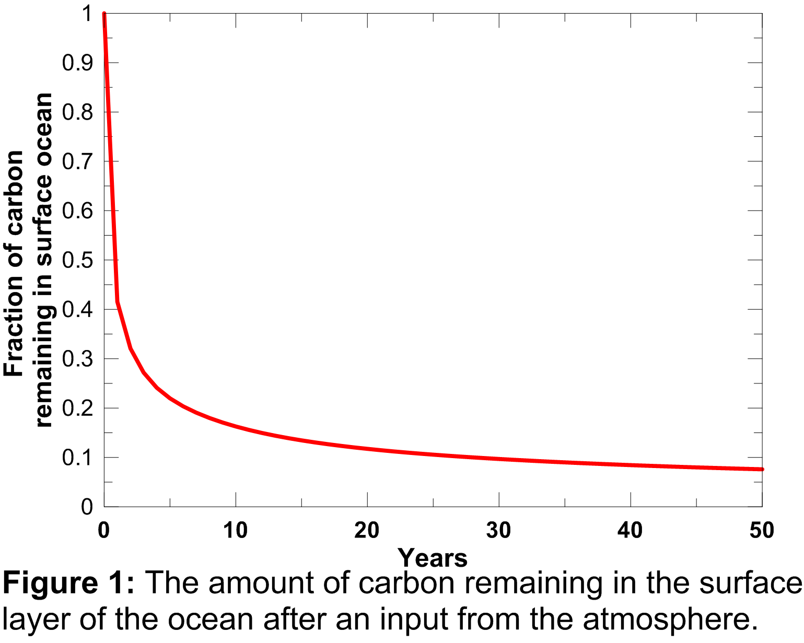
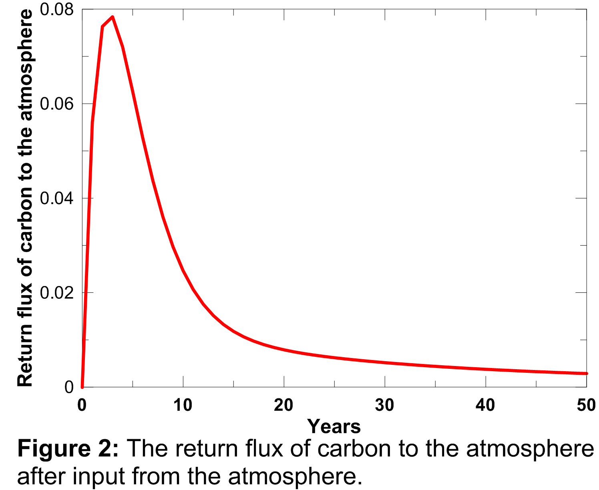
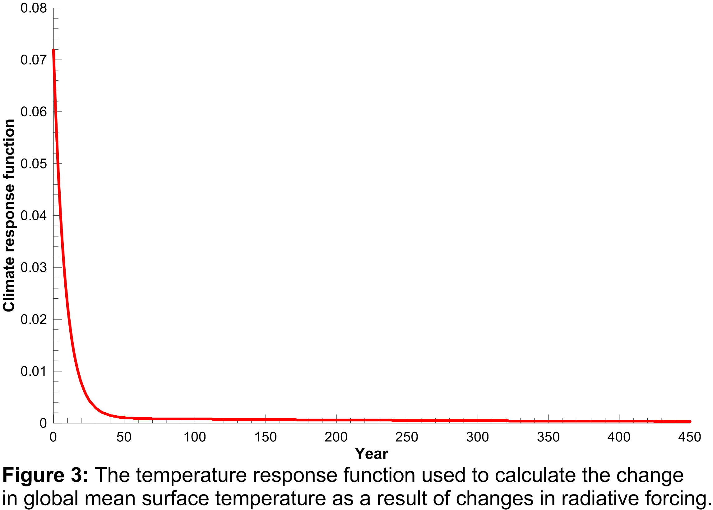
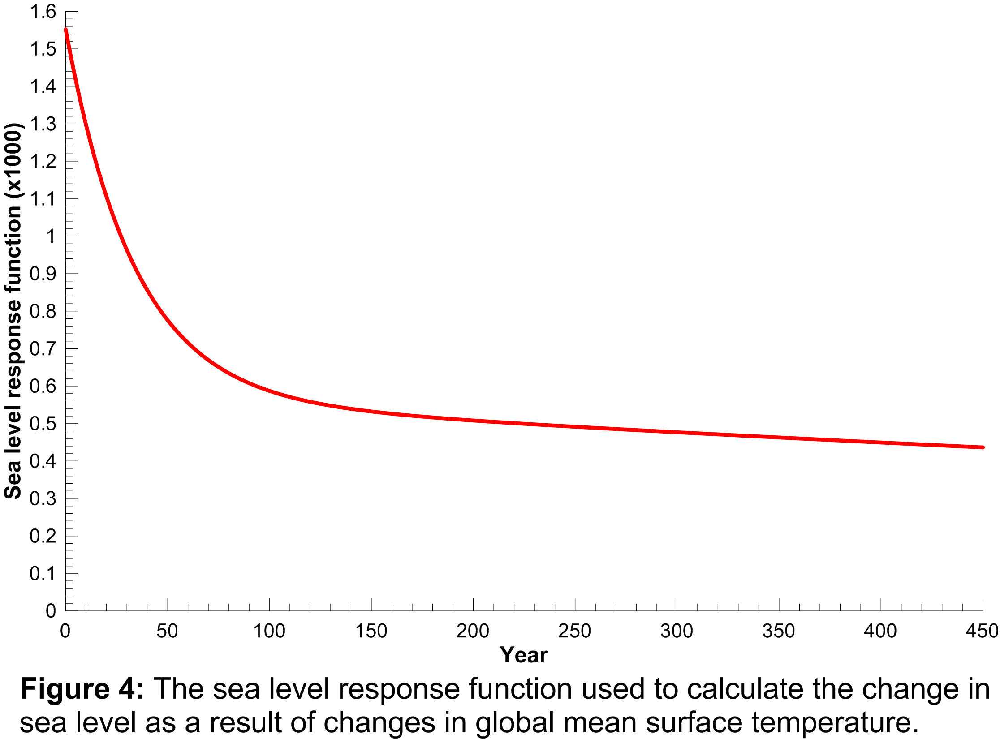

.. |H2O| replace:: H\ :sub:`2`\ O
.. |CO2| replace:: CO\ :sub:`2`
.. |CH4| replace:: CH\ :sub:`4`
.. |N2O| replace:: N\ :sub:`2`\ O
.. |O3| replace:: O\ :sub:`3`\

====================
 Theory
====================

This simple climate model tracks the causal chain from emissions of radiatively active gases, usually referred to as greenhouse gases (GHGs), to changes in their atmospheric concentrations, to changes in radiative forcing, to changes in global mean surface temperature and finally to changes in global mean sea-level. Each of these steps in described in a separate section below.

The model requires input time series of the three primary anthropogenic
GHGs viz. |CO2|, |CH4|, |N2O| and sulfate aerosol. That said, if the effects of any of these do not need to be accounted for in the simulation, they can be set to zero. The model is referred to as a 'simple' climate model to differentiate it from complex atmosphere ocean general circulation models (AOGCMs). AOGCMs are extremely computationally demanding, often requiring months of processing on massively parallel computers to complete a single climate simulation. AOGCMs therefore cannot be used for long or complex analyses e.g. those requiring multiple model runs for different scenarios based on different input data sets. Simple climate models have been used extensively in the IPCC assessment reports for the calculation of global warming potentials etc. They reproduce the essential behaviour of the far more complex AOGCMs by parameterizing key processes that are dealt with in detail by AOGCMs. The result is that simple climate models cannot reproduce the detailed spatial variability in climate change nor reproduce the detailed observed variability in climate change that AOGCMs do. Simple climate models are therefore used to model changes in global parameters such as changes in the global concentrations of GHGs, changes in global radiative forcing, changes in global mean surface temperature, and
changes in sea level.

--------------------
Prescribing GHG emissions in the model
--------------------
GHG emissions are prescribed in the simple climate model using emissions data files as discussed in the documentation for the code. Emissions are always global emissions and can come from any source, including purely synthetic data e.g. a pulse emission of |CH4| to calculate the global warming potential of methane. Emissons should, ideally include all sources, e.g. changes in |CO2| emissions resulting from changes in land use. The prescribed emissions need to at least cover the time period for which you plan to run the model.

--------------------
Converting emissions to concentrations
--------------------
The pulse substitute version of the Bern Carbon Cycle (CC) model is used to convert |CO2| emissions to atmospheric |CO2| concentrations. This is described in greater detail in Joos *et al.* (1996). This paper is available `here <http://storage.bodekerscientific.com/Joos1996.pdf>`_ .

This version of the Bern CC model is a slightly simpler model than the full Bern CC model and has been tuned to precisely mimic the response of the Bern CC model to changes in |CO2| emissions. Specifically, an ocean mixed-layer pulse response function is derived to characterize the exchange of carbon between the surface and deep ocean by tuning to the HILDA ocean model that is used in the Bern CC model. The ocean mixed-layer pulse response function shows what fraction of |CO2| remains in the surface layer of the ocean as a function of time after a pulse of |CO2| from the atmosphere. As detailed in Joos *et al.* (1996), the advantages of the pulse substitute version of the
model over the full model are:

1. It allows cost-effective calculations of the relationship between |CO2| emissions and atmospheric concentrations for different scenarios. The pulse substitute version of the model produces the same results as the full model but is computationally more efficient and therefore allows multiple runs with, for example, different global GHG emission time series.
2. Problems of non-linearities arising from seawater chemistry are avoided giving more accurate results.
3. It provides a simple measure of the surface to deep mixing and allows comparison of the behaviour of different ocean transport models.

Joos *et al.* (1996) have demonstrated in detail that the pulse substitute version of the Bern CC model produces virtually the same results as the HILDA model and the Princeton 3-D and 2-D ocean models against which it was compared. Together with the ISAM model, the Bern CC model has been used extensively in recent IPCC assessment reports.

In the first year of the model simulation it is assumed that atmospheric |CO2| concentrations are at their pre-industrial level (278 ppm), the partial pressure of |CO2| in the surface layer of the ocean is in equilibrium with atmospheric |CO2| concentrations, and the net flux of |CO2| between the atmosphere and biosphere is zero. By the end of the second year of the model simulation however, and assuming that |CO2| emissions during the previous year were not zero, those |CO2| would raise atmospheric |CO2| concentrations. The excess |CO2| loading is calculated by taking the |CO2| emissions in PgC and dividing by 2.123, the conversion factor for PgC to ppm of |CO2|. The elevated
atmospheric |CO2| concentration drives a flux of |CO2| between the atmosphere
and the ocean. The magnitude of the flux is calculated using :math:`f_{as} = k_g (\delta pCO_{2,a} - \delta pCO_{2,s})` where :math:`\delta pCO_{2,a}` is the the perturbation to atmospheric |CO2| concentrations, :math:`\delta pCO_{2,s}` is the current perturbation to sea water |CO2| concentrations (this will be zero at the start of the model run), and :math:`k_g` is the air-sea gas exchange coefficient which is hard-coded in the model but can be changed at your discretion.

The elevated atmospheric |CO2| concentration also stimulates plant growth and this results in a flux of carbon from the atmosphere into the biosphere. However, this is partially offset by |CO2| returned to the atmosphere as a result of the decay of the enhanced plant growth resulting from the higher |CO2|. The net primary production and decay of biospheric material is therefore treated separately as :math:`f_{fer} = \delta f_{npp} - \delta f_{decay}` where :math:`f_{fer}` is the biospheric fertilization, :math:`\delta f_{decay}` is the return flux as a result of decay (detailed below), and :math:`\delta f_{npp}` is the change in net primary production as a result of elevated |CO2| concentrations, given by :math:`\delta f_{npp} = 60 {\rm GtC/year} \times \beta \times \ln({\rm CO}_{2,a}/278 {\rm ppm})` where :math:`\beta` is the fertilization factor set to 0.287. This is hardcoded but can be changed at the users discretion. Note in the above equation that when atmospheric |CO2| levels are at their pre-industrial level (278 ppm), the change in net primary productivity is zero. This equation is non-linear as a result of the logarithmic term :math:`\ln({\rm CO}_{2,a}/278 {\rm ppm})`.

The atmospheric-ocean flux produces an increase in dissolved inorganic carbon in the ocean, not only in the current year, but also in future years as it takes a number of years for the carbon pulse to decay away. This process is governed by the ocean mixed-layer pulse response function which is plotted in Figure 1.

An explanation of this function and its mathematical form is provided in Appendix A.2.2 of Joos *et al.* (1996). The contribution of the atmosphere-ocean carbon flux is therefore accumulated forward, discounted using the curve plotted above, through to the end of the model run. Elevated dissolved inorganic carbon drives an increase in surface water |CO2| concentrations (:math:`\delta pCO_{2,s}`) which is calculated using equation 6b of Joos *et al.* (1996).

Similarly, the return flux of carbon as a result of decay of enhanced net primary production, depends both on the magnitude of the enhanced net primary production and a response function which describes the turnover time of the photosynthesised carbon. This response function is plotted below and was calculated using the equation presented in Appendix A.3 of Joos *et al.* (1996).

The area under the curve plotted in Figure 2 is 1.0, indicating that the additional carbon taken up in the biosphere as a result of stimulated plant growth does not represent permanent removal from the atmosphere, and it is all returned to the atmosphere eventually as a result of decay of the additional growth. The return flux of carbon from the biosphere to the atmosphere is therefore accumulated forward, discounted using the curve plotted in Figure 2, through to the end of the model run.

The change in net primary productivity and the return flux of carbon from the biosphere to the atmosphere as a result of the decay of the enhanced net primary production can both depend on temperature. Joos *et al.* (2001) have suggested that higher surface-air temperatures and changes in the hydrological cycle may cause increased respiration of the carbon stored in soil and litter owing to higher bacterial activity at higher temperatures (Lloyd and Taylor, 1994; Rustad, 2000; Cox *et al.*, 2000], reduced net primary production because of high temperatures and/or reduced water availability, and dieback of extant forests in response to heat or drought stress (Smith and Shugart, 1993; Cox *et al.*, 2000]. These temperature dependencies have not been included in these calculations in line with the methodology proposed by Joos *et al.* (1996). Up until now, changes in global mean tempature and changes in the hydrological cycle are not large enough to significantly drive these feedback mechanisms. However, this may not be true for the future and including these feedbacks would be one possible way to improve the performance of this model.

|CO2| concentrations for the next year are then calculated from |CO2| emissions in the current year (divided by 2.123 to convert PgC to ppm), less the |CO2| resulting from the flux of |CO2| from the atmosphere to the ocean and the biosphere (from elevated |CO2| levels in all previous years), plus the return flux from the biosphere to the atmosphere (from elevated primary productivity in all previous years).

This procedure is repeated over all years to generate a time series of calculated atmospheric |CO2| concentrations.

Changes in |CH4| and |N2O| concentrations resulting from changing emissions were calculated by integrating the ordinary differential equations describing their budgets, i.e.

d[|CH4|]/dt = |CH4| emissions - [|CH4|]/:math:`\tau_{\rm CH4}`

and

d[|N2O|]/dt = |N2O| emissions - [|N2O|]/:math:`\tau_{\rm N2O}`

where [|CH4|] and [|N2O|] are the are the concentrations, and :math:`\tau_{\rm CH4}` and :math:`\tau_{\rm N2O}` are the atmospheric lifetimes of |CH4| and |N2O|, selected as 10 and 114 years respectively. The assumption of fixed lifetimes for |CH4| and |N2O| is a simplification since these values depend on the evolution of OH and O\ :sub:`3`\ . These in turn are a function of pollutant
emissions. Including these dependencies is another possible improvement to the model.

--------------------
Converting changes in concentrations to radiative forcing
--------------------
Radiative forcing provides a convenient first-order measure of the climatic importance of perturbations to the planetary radiation balance (Ramaswamy *et al.*, 2001; Shine *et al.*, 1990; Shine and Forster, 1999). The change in radiative forcing was calculated as the sum of the changes in radiative forcing from changes in |CO2|, |CH4|, |N2O| and sulphate aerosol concentrations. The formulae used for |CO2|, |CH4| and |N2O| radiative forcing are those given in Table 6.2 of the IPCC Third Assessment Report (pg 358), viz.:

RF(|CO2|) = 5.35 Wm\ :sup:`2`\ (ln([CO\ :sub:`2`\(t)]/[CO\ :sub:`2`\ (t\ :sub:`0`\)])

where [CO\ :sub:`2`\ (t)] is the current |CO2| concentration, and [CO\ :sub:`2`\ (t\ :sub:`0`\)] is the unperturbed |CO2| concentration (278 ppm). Radiative forcing for |CH4| (in ppb) is

.. math:: RF(CH_4) = 0.036 Wm^{-2} [\sqrt{CH_4(t)}-\sqrt{CH_4(t_0)}]-{\rm f}[CH_4(t),N_2O(t_0)]-{\rm f}[CH_4(t_0),N_2O(t_0)]

where [CH\ :sub:`4`\ (t)| is the current |CH4| concentration, and [CH\ :sub:`4`\ (t\ :sub:`0`\ )] is the unperturbed |CH4| concentration (700 ppb), and the function f accounts for the overlap in |CH4| and |N2O| bands and is:

.. math:: \mathrm{f}(M,N) = 0.47 \times \ln(1+2.01 \times 10^{-5} (MN)^{0.75} + 5.31 \times 10^{-15} M(MN)^{1.52})

A similar formula is used to calculate the radiative forcing due to |N2O| (in ppb), viz:

.. math:: RF(N_2O) = 0.12 Wm^{-2} [\sqrt{N_2O(t)}-\sqrt{N_2O(t_0)}]-{\rm f}[CH_4(t_0),N_2O(t)]-{\rm f}[CH_4(t_0),N_2O(t_0)]

Estimates of direct and indirect aerosol radiative forcing are based on a UK Met. Office Hadley Centre climate model run (HadCM3). Model results were used to determine factors relating sulfate emissions in the EDGAR database to radiative forcing. The direct radiative forcing, assumed to be proportional to instantaneous emissions, results from absorption of incoming solar radiation. Indirect effects result from changes to the optical properties of clouds as sulfate aerosols are important cloud condensation nuclei. Joos *et al.* (2001) used a similar approach and derived simple expressions for direct and indirect sulphate aerosol radiative forcing based on SO\ :sub:`x`\  emissions (their appendix A3). Use of the Joos *et al.* (2001) formulae yields total sulfate
aerosol forcing about 15% higher than the values produced by our model.

--------------------
Converting changes in radiative forcing to changes in global mean surface temperature
--------------------

The change in global mean surface temperature resulting from changes in radiative forcing is calculated using a double exponential impulse response function model. This is a two box linear model that has been fitted to HadCM3 model run for a 4 :math:`\times` |CO2| scenario. The equation is:

.. math:: \Delta T(t) = \frac{\Delta T_{2\times}}{Q_{2\times}} \int^t_{t_0} Q(t^\prime) \left[ \sum^2_{s=1} l_s (1/\tau_s) \exp^{-(t-t^\prime)/\tau_s} \right] dt^\prime

where the coefficients :math:`l_1`, :math:`l_2`, :math:`\tau_1`, and :math:`\tau_2` were obtained from the fit to the HadCM3 run. The double exponential response function is essentially the climate response function
to the change in radiative forcing and acts as a long-term integrator of the radiative forcing. The climate response function used in the model is plotted in Figure 3.

The function shows that elevated radiative forcing drives an increase in global mean surface temperature for a few years into the future, but the response drops off rapidly with time.

The total radiative forcing calculation described above is incomplete since it does not include forcing due to other gases, such as ozone and CFCs. Therefore the :math:`\Delta T_{2\times}/Q_{2\times}` coefficient in the equation above is adjusted to 1.1 to give a reasonable simulation of recent temperatures. The forcing caused by a doubling of |CO2| quoted in the IPCC TAR (page 358) is 3.71 Wm\ :sup:`-2`\, while the same value estimated from the HadCM3 run was 3.74 Wm\ :sup:`-2`\. The resultant climate sensitivity parameter (the equilibrium change in global mean surface temperature following a doubling of the atmospheric equivalent |CO2| concentration) was therefore 4.11 (=1.1 :math:`\times` 3.74). This value is within the range of expected values quoted in the IPCC TAR,

--------------------
Converting changes in global mean surface temperature to sea level rise
--------------------
An approach similar to that used to calculate the temperature response to radiative forcing changes was used to calculate the sea level rise response to global mean surface temperature changes i.e. a double exponential impulse response function is used where the four coefficients required are obtained from fits to a Hadley Centre climate model run (HadCM3) for a 4 :math:`\times` |CO2| scenario. The sea level response function is plotted in Figure 4 where the response function values have been multiplied by 1000 for clarity.

It is clear from this function that sea level responds to changes in global
mean surface temperature many years into the future i.e. the response is still far from zero 450 years after a change in global mean surface temperature. In this sense, sea level acts as a long-term integrator of global mean surface temperature changes and gives an impression of the long-term consequences of current GHG emissions.

This calculation accounts only for the change in sea level resulting from thermal expansion of the ocean; it does not include the effects of melting glaciers and melting grounded ice sheets. Attribution of causes of sea-level change is highly uncertain. Over the period 1910 to 1990 model estimated rates of net sea-level change are from -0.8 mm/year to 2.2 mm/year with a central value of 0.7 mm/year (negative values result from increased terrestrial storage of water and increased precipitation over Antarctica) [Table 11.10, TAR]. The model estimates of rates of sea-level change due to thermal expansion alone are between 0.3 mm/year and 0.7 mm/year with a central value of 0.5 mm/year [Table 11.10, TAR]. Over the period 1910 to 1990 sea-level rise from thermal expansion is approximately 3 times larger than that from the melting of glaciers and ice caps [Figure 11.10a, TAR]. Projected sea-level changes from 1990 to 2100 suggest thermal expansion of 0.11 to 0.43 m, accelerating through the 21st century, with a glacier contribution of 0.01 to 0.23 m, a Greenland contribution of -0.02 to 0.09 m, and an Antarctic contribution of -0.17 to 0.02 m [Chapter 11 executive summary, TAR]. Although thermal expansion dominates the other factors responsible for sea level rise, both in the past and in the future, the goal of the model is not to exactly reproduce observed or AOGCM modelled sea level changes in the past or future, but rather to use sea level rise (from thermal expansion alone) as a measure of the long-term climate impacts resulting from past and current anthropogenic emissions.

--------------------
References
--------------------
Cox, P.; Betts, R.; Jones, C.; Spall, S.; Totterdell, I. (2000). Will carbon-cycle feedbacks accelerate global warming in the 21st century?, *Nature 408*: 184-187.

Joos, F.; Bruno, M.; Fink, R.; Siegenthaler, U.; Stocker, T.F.; le Quere, C.; Sarmiento, J.L. (1996). An efficient and accurate representation of complex oceanic and biospheric models of anthropogenic carbon uptake. *Tellus 48B*: 397-417.

Joos, F.; Prentice, I.C.; Sitch, S.; Meyer, R.; Hooss, G.; Plattner, G.-K.; Gerber, S.; Hasselmann, K. (2001). Global warming feedbacks on terrestrial carbon uptake under the Intergovernmental Panel on Climate Change (IPCC) emissions scenarios. *Global biogeochemical cycles 15(4)*: 891-907.

Lloyd, J.; Taylor, J.A. (1994). On the temperature dependence of soil respiration, *Functional Ecology 8*: 315-323.

Ramaswamy, V.; Boucher, O.; Haigh, J.; Hauglustaine, D.; Haywood, J.; Myhre, G.;
Nakajima, T.; Shi, G.Y.; Solomon, S. (2001). Radiative forcing of climate change, in *Climate Change 2001: The Scientific Basis, Contribution of Working Group I to the Third Assessment Report of the Intergovernmental Panel on Climate Change*, edited by J.T. Houghton *et al.*, pp. 349-416, Cambridge University Press, New York.

Rustad, L. (2000). Warming effects on ecosystem functioning, *Newsl. Global Change Terr. Ecosyst. Core Proj. IGBP 16*, 4-5.

Shine, K.; Derwent, R.G.; Wuebbles, D.J.; Morcrette, J.-J. (1990). Radiative forcing of climate, in *Climate Change: The IPCC Scientific Assessment*, edited by J.T. Houghton, G.J. Jenkins and J.J. Ephraums, pp. 41-68, Cambridge University Press, New York.

Shine, K.P.; Forster, P. (1999). The effect of human activity on radiative forcing of climate change: A review of recent developments, *Global Planetary Change 20*: 205-225.

Smith, T.M.; Shugart, H.H. (1993). The transient response of terrestrial carbon storage to a perturbed climate, *Nature 361*, 523-526.